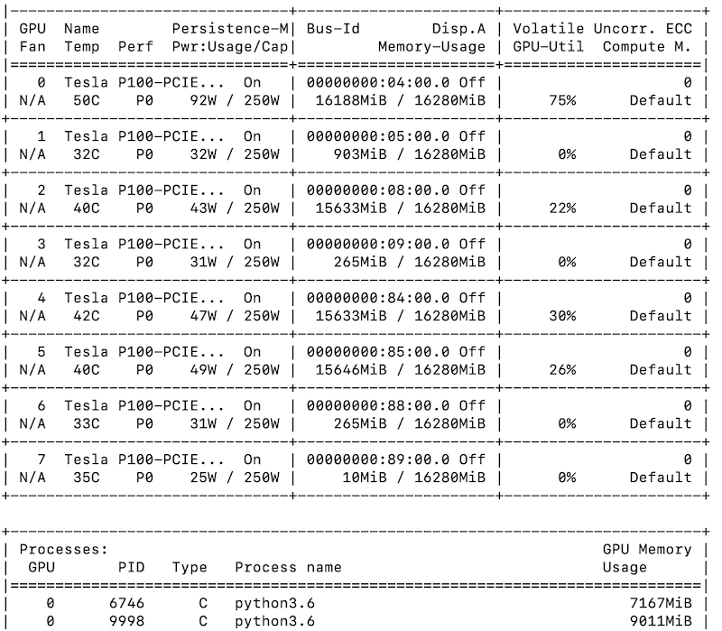

# Setting up SSH with GitHub

[Wonderful tutorial from Github itself](https://help.github.com/en/github/authenticating-to-github/connecting-to-github-with-ssh)

**Do this first!** If you have an ssh key that's in `ssh-agent` you are less likely to get a password prompt when ssh'ing into CSUA. It's also necessary if you want to push to Github from CSUA.

# How to set up CSUA

1. Create an account
2. Copy the `id_rsa.pub` file you created earlier. SSH to latte, create a `~/.ssh/authorized_keys' file and copy the public key there.
4. It should be possible to `ssh` to `[yourusername]@latte.csua.berkeley.edu` now. For convenience, you could add the following to your `~/.ssh/config` file so that `ssh csua` just works.
```
Host latte
  HostName latte.csua.berkeley.edu
  User YOUR_USER_NAME
  IdentityFile PATH/TO/PRIVATE_KEY
```

Other tips:

`ssh -A` will keep your credentials. So, for instance, if you have Github SSH acccess on your machine, `-A` will allow you to push to Github from your CSUA machine.

`ssh -i path/to/key` if you need to authenticate with a specific key.

There is another machine, `[yourusername]@soda.csua.berkeley.edu` which does not have GPUs. It's kind of like an extra hive machine. Maybe extra CPU for your 170 project :)

# How to set up Jupyter 

Open two terminal windows, A and B.

In window A, `ssh latte` (or `ssh username@latte.csua.berkeley.edu`) and then install jupyter.

Run `jupyter notebook --no-browser` and check which port it's using (in its terminal output).

There should be a line `http://localhost:8888/?token=088de52ac910000087c9c24a15de8a0c68665ab1c2ee0687` or something like that.

Then in window B, run `ssh -N -L [to]:localhost:[from] [username]@latte.csua.berkeley.edu`

**from** is the port that Jupyter is running on CSUA (the number that you saw earlier).
**to** is the port you want to connect Jupyter to on your machine. Ideally, you would set this to **from** as it makes everything easier. But if **from** is in use, you can find an open port by 

  1. Run Jupyter on your machine, note which port it uses
  2. Kill Jupyter, use that port as **from**.

Keep the ssh running. Now, in a browser, copy the line from above, but change the port number to **to**.

> **Example**
> http://localhost:8888/?token=088de52ac910000087c9c24a15de8a0c68665ab1c2ee0687
> 
> so **from** is 8888.
>
> but **to** is 8890.
>
> then you would want to open the URL 
>
> http://localhost:8890/?token=088de52ac910000087c9c24a15de8a0c68665ab1c2ee0687
>
> in a browser.

It should connect to Jupyter.

### It asked for a token??

This happens sometimes.

1. Make sure you forwarded the correct **from** port. If you are connecting to someone else's CSUA server, your token will be rejected.
2. Make sure you copied the full token in the URL.
3. Try using `localhost:[to]:localhost:[from]` in the `ssh -N -L` command.
3. Try entering the token manually when Jupyter asks for it.

# Working with CUDA

`nvidia-smi` is a wonderful CUDA command. It will list the GPU usage.

{.invert}

You want to use GPUs with low `Volatile GPU-Util` and low `Memory-Usage`.

However, CSUA will by default assign you two random GPUs.

You can see which ones these are with `echo $CUDA_VISIBLE_DEVICES`.

If these are busy GPUs, or they are two of the same GPU (e.g. having a `CUDA_VISIBLE_DEVICES` of `0,0` will confuse Pytorch!) you may want to reassign them.

If you want to use more than two GPUs... well once I used 8 GPUs and my program was canceled along with a warning message. Be a good citizen :) many people want to ML on this cluster!

If you want to set your GPUs to, say, 6 and 7 run the command `export CUDA_VISIBLE_DEVICES=6,7`. It's that simple! There are 8 GPUs available, numbered 0 through 7.

# Tensorflow, Pytorch, and virtualenv quickstart

Create a virtualenv with `python3 -m venv [name-of-env]`. When you're in the virtualenv your terminal will have a `(name-of-env)` before the prompt.

You can exit the environment with `deactivate`, and enter it with `source [name-of-env]/bin/activate`.

Install Pytorch and Tensorflow via pip.

Then run the following notebook to make sure GPU access is working:

(coming soon!)